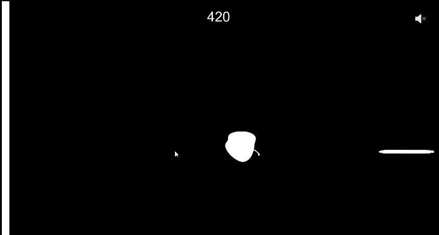

# Unity practice in C#  
Languages shown as javascript due to WebGL builds  
  
## Contents
Challenge - Create game scenes from scratch  
Playables - Browser playable WebGL builds  
TestScenes - Testing playground for unplayable scenes (Tutorials, Unity features/scripts, etc.)  
  
## Playables  
  
  
[Play ApplePen](https://catsmile-nico.github.io/Unity-Practice/Playables/ApplePen/index.html)  
> [ BASE IDEA ] By CoolCat, press key at right time to put pen(moving) into apple(moving)  
> [ CONTROLS ] Mouse click to shoot; Mouse to move  
> [ HOW TO PLAY ] 1. Shoot pen,  2. Aim at center of apple, 3. Can you beat the highscore limit?  
> [ DEV FOCUS ] Collision, Rigidbody, Tag handling
  
  
  

[Play Winterbell-clone](https://catsmile-nico.github.io/Unity-Practice/Playables/Winterbell-clone/index.html)  
> [ BASE IDEA ] Remake of Ferryhalim's Winterbell  
> [ CONTROLS ] Mouse to move; Mouse click for initial Jump  
> [-HOW TO PLAY-] 1. Jump once,  2. Move character with mouse,  3. Hit Asteroids to continue jumping for as long as you can.  
> [ DEV FOCUS ] Recreate existing game.
  
  
  
  
[Play StressExplosion](https://catsmile-nico.github.io/Unity-Practice/Playables/StressExplosion/index.html)  
> [ BASE IDEA ] By kinoko, type words and shoot words to release stress  
> [ CONTROLS ] LEFT/RIGHT or A/D to move; SPACE to shoot;  ESC to clearscreen  
> [-HOW TO PLAY-] 1. Enter text into textbox,  2. Shoot your "stress",  3. Relieve stress through explosions created.  
> [ DEV FOCUS ] Making use of UI as game element. Shooting text with UI.Text instead of individual 2D/3D asset.  
> [ NOTE ] Game is intended for Japanese language, but currently IME not supported on WEBGL  
  
DISCLAIMER: Most asset(Art/Sound) used are simply placeholders to aid in faster development. I will remove them if requested however.  
