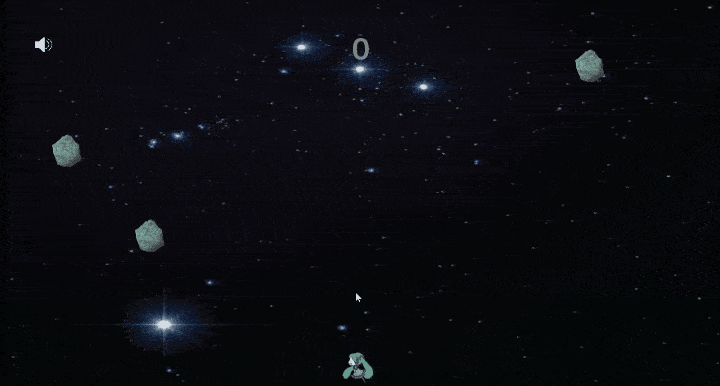

# Unity practice in C#  
Languages shown as javascript due to WebGL builds  
  
## Contents
2D Tutorial - Tutorial practice for 2D game  
Challenge - Create game scenes from scratch  
TestBuilds - Browser playable WebGL builds
  
## TestBuilds  
  

[Play Winterbell-clone](https://catsmile-nico.github.io/UnityPrac/TestBuilds/Winterbell-clone/index.html)  
> [ CONTROLS ] Mouse to move; Mouse click for initial Jump  
> [ HOW TO PLAY ] 1. Jump once,  2. Move character with mouse,  3. Hit Asteroids to continue jumping for as long as you can.  
  

[Play StressExplosion](https://catsmile-nico.github.io/UnityPrac/TestBuilds/StressExplosion/index.html)  
> [ CONTROLS ] LEFT/RIGHT or A/D to move; SPACE to shoot;  ESC to clearscreen  
> [ HOW TO PLAY ] 1. Enter text into textbox,  2. Shoot your "stress",  3. Relieve stress through explosions created.  
> [ NOTE ] Game is intended for Japanese language, but currently IME not supported on WEBGL  
  
  
DISCLAIMER: Most asset(Art/Sound) used are simply placeholders to aid in faster development. I will remove them if requested however.  
